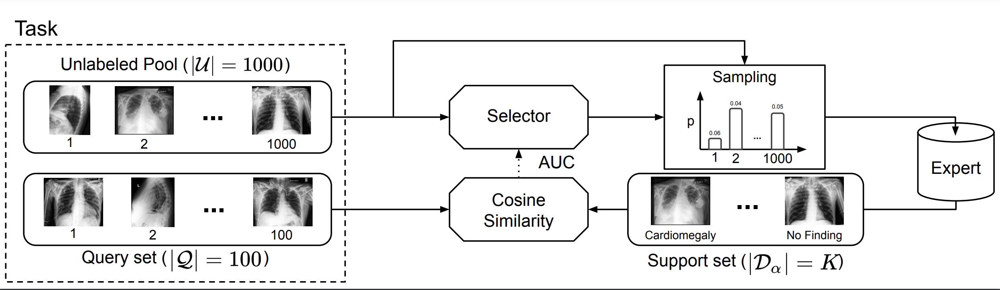

# MedSelect: Selective Labeling for Medical Image Classification Combining Meta-Learning with Deep Reinforcement Learning

MedSelect is a deep-learning based selective labeling strategy for medical images based on image embeddings obtained from contrastive pretraining.

Paper: https://arxiv.org/abs/2103.14339

## Abstract

We propose a selective learning method using meta-learning and deep reinforcement learning for medical image interpretation in the setting of limited labeling resources. Our method, MedSelect, consists of a trainable deep learning selector that uses image embeddings obtained from contrastive pretraining for determining which images to label, and a non-parametric selector that uses cosine similarity to classify unseen images. We demonstrate that MedSelect learns an effective selection strategy outperforming baseline selection strategies across seen and unseen medical conditions for chest X-ray interpretation. We also perform an analysis of the selections performed by MedSelect comparing the distribution of latent embeddings and clinical features, and find significant differences compared to the strongest performing baseline. We believe that our method may be broadly applicable across medical imaging settings where labels are expensive to acquire.



## Prerequisites
(Recommended) Install requirements, with Python 3.7 or higher, using pip.

```
pip install -r requirements.txt
```

OR

Create conda environment

```
conda env create -f environment.yml
```

Activate environment

```
conda activate medselect
```

GPU usage is required. By default, all available GPU's will be used.

## Dataset

We use ~224316 chest X-rays from [CheXpert](https://arxiv.org/abs/1901.07031). We view X-rays with "Uncertain" labeling as positive for a given condition.

We use image embeddings from [MoCo pretraining](https://arxiv.org/abs/2010.05352), developed by H Sowrirajan, J Yang, AY Ng, and P Rajpurkar. See [here](https://github.com/stanfordmlgroup/MoCo-CXR) for their full code release.

## Usage

### Convert Chest X-rays to Image Embeddings

Run the following cell providing these arguments:
1. path_to_input_data: path to the .csv file containing X-ray file paths.
2. output_path: path to intended output hdf5 file, e.g. "output.hdf5".
3. path_to_moco_checkpoint: path to MoCo checkpoint. See [here](https://github.com/stanfordmlgroup/MoCo-CXR) for suggested checkpoints to use. The checkpoint we use can be downloaded [here](https://github.com/stanfordmlgroup/MoCo-CXR) - need to update link to checkpoint.

```
python3 xray_to_hdf5.py -d path_to_input_data -o output_path -c path_to_moco_checkpoint
```

### Train the Model - need to update argument lists

Run the following cell providing these arguments:
1. path_to_train_positive: path to the .csv file containing positive X-ray file paths for training.
2. path_to_train_nofinding: path to the .csv file containing no-finding X-ray file paths for training.
3. path_to_val_positive: path to the .csv file containing positive X-ray file paths for validation.
4. path_to_val_nofinding: path to the .csv file containing no-finding X-ray file paths for validation.
5. use_asg: a boolean value specifying whether to use age, sex and laterality along with image embeddings during training.

```
python3 run_selector.py
```

# Citation

If you use MedSelect in your work, please cite our paper:

```
@misc{smit2021medselect,
      title={MedSelect: Selective Labeling for Medical Image Classification Combining Meta-Learning with Deep Reinforcement Learning},
      author={Akshay Smit and Damir Vrabac and Yujie He and Andrew Y. Ng and Andrew L. Beam and Pranav Rajpurkar},
      year={2021},
      eprint={2103.14339},
      archivePrefix={arXiv},
      primaryClass={cs.CV}
}
```
